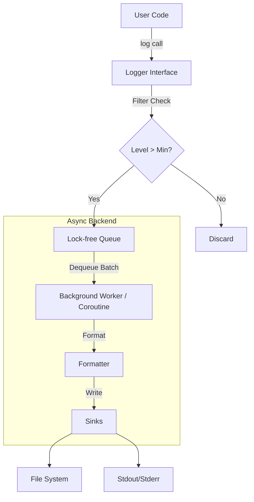

# System Architecture

CoLog follows the design philosophy of mainstream logging ecosystems (like spdlog, log4j, Serilog), focusing on modularity, extensibility, and performance.

## 🏗️ High-Level Design

The core architecture consists of three main layers:

1.  **Logger**: The frontend interface used by the application.
2.  **Formatter**: Responsible for converting log events into bytes (String or JSON).
3.  **Sink**: The destination for the logs (File, Console, Network).

### Data Flow



## 🧩 Core Components

### 1. The Logger (Frontend)
The entry point for the application. It handles:
- **API**: `info()`, `warn()`, `error()` methods.
- **Level Filtering**: Fast integer comparison to discard logs early.
- **Enqueueing**: Pushing captured log arguments/timestamp to the shared queue.

### 2. The Shared Async Backend
To ensure high throughput and prevent blocking the main thread, CoLog uses a centralized backend.

- **Lock-free Queue**: Uses SPSC (Single-Producer-Single-Consumer) or MPMC queues to bridge user threads and the flush worker.
- **Background Worker**: A dedicated thread or coroutine loop that:
    1.  Wakes up when data is available or on timeout (latency guarantee).
    2.  Dequeues a batch of log events.
    3.  Passes events to the formatter.
    4.  Flushes to sinks.

### 3. Sinks (Output Destinations)
Abstracts the I/O operations.
- `FileSink`: Writes to disk with buffering. Supports rotation (size/time).
- `ConsoleSink`: Writes to `stdout`/`stderr` (often with colors).
- `NullSink`: Discards output (used for benchmarking pure CPU overhead).

## 📂 Module Structure

The project is organized to separate concerns and enable easy testing.

```text
logger-core/
  ├─ api/
  │    ├─ Logger Interface            # Public API
  │    └─ Registry                    # Manages logger instances
  │
  ├─ backend/
  │    ├─ Async Backend               # Queue + Worker management
  │    ├─ Queue Abstraction           # SPSC / MPMC implementations
  │    └─ Worker Controller           # Thread/Coroutine lifecycle
  │
  ├─ formatting/
  │    ├─ Formatter Interface         
  │    ├─ Pattern Formatter           # Text: "%Y-%m-%d [%l] %v"
  │    └─ JSON Formatter              # Structured logging
  │
  ├─ sinks/
  │    ├─ Sink Interface              
  │    ├─ File Sink
  │    ├─ Console Sink
  │    └─ Null Sink
  │
  └─ config/
       └─ Config Model                # Configuration structs
```

## 🔄 Cross-Platform I/O Strategy

To achieve maximum performance across platforms:

| Platform | Implementation Strategy |
|----------|-------------------------|
| **Windows** | WinAPI (Overlapped I/O or IOCP for advanced usage) |
| **Linux** | POSIX `write` / `io_uring` (future scope) |
| **macOS** | POSIX `write` / Kqueue |

A unified `FileWriter` interface abstracts these implementation details.


